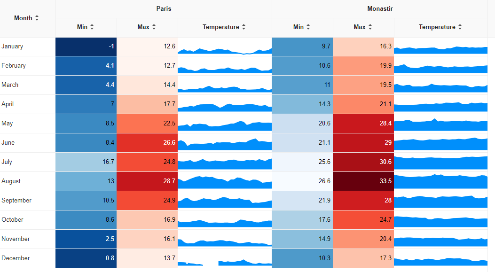
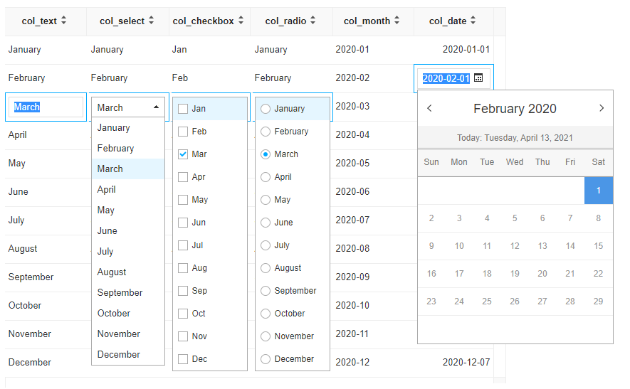
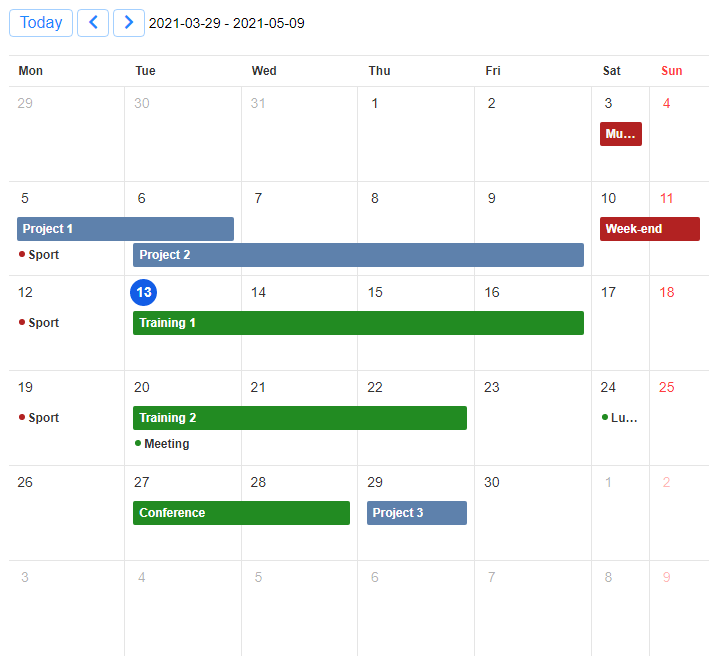
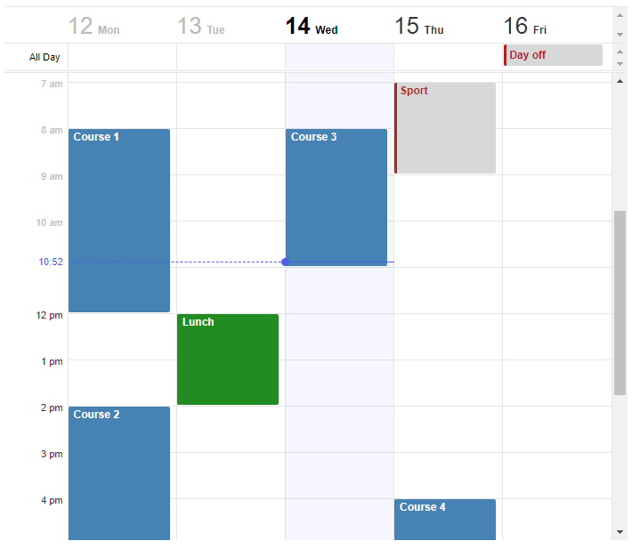
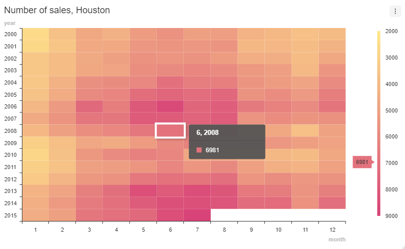
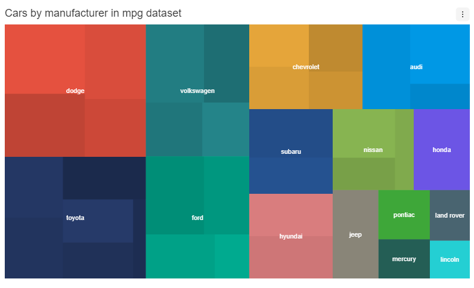

# toastui

> R Htmlwidgets for [TOAST UI](https://ui.toast.com/) JavaScript libraries: [Grid](https://ui.toast.com/tui-grid/), [Calendar](https://ui.toast.com/tui-calendar/) and [Chart](https://ui.toast.com/tui-chart/).

<!-- badges: start -->
[](https://lifecycle.r-lib.org/articles/stages.html#experimental)
[](https://github.com/dreamRs/toastui/actions)
<!-- badges: end -->


## Installation

You can install toastui from GitHub with:

```r
remotes::install_github("dreamRs/toastui")
```

## Grid

Interactive tables with data editing, filtering, sorting, and more. See documentation and examples:



Edit mode example:




## Calendar

Interactive daily, weekly or monthly calendar. See documentation and examples:

* Monthly view:



* Weekly view:




## Chart

Interactive charts:





## Development

This package uses [packer](https://github.com/JohnCoene/packer) to manage JavaScript source code and dependencies. If you want to modify it, you'll need a working installation of [Node.js](https://nodejs.org/en/).

After cloning the Git repository, install nodes modules with:

```r
packer::npm_install()
```

Modify code in `srcjs/` directory, then run:

```r
packer::bundle_prod() # or packer::bundle_dev()
```

Re-install the package or use `pkgload::load_all()` to try changes.


