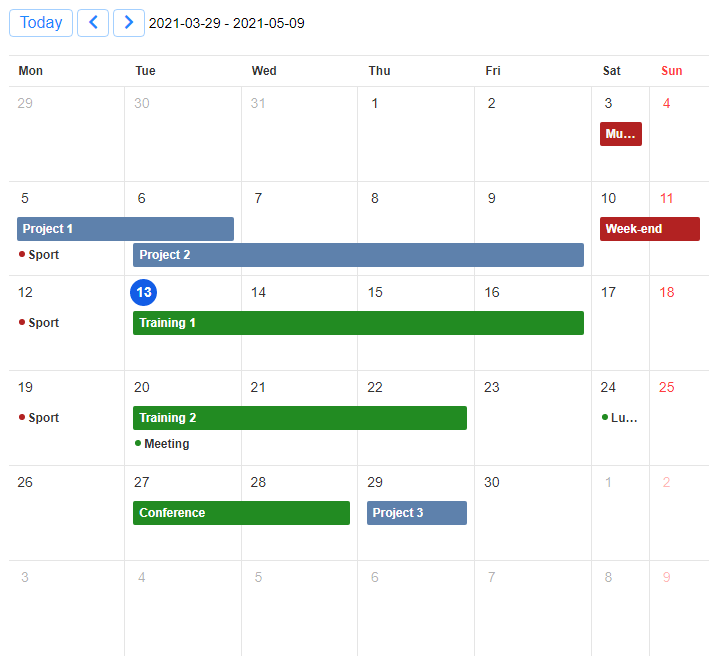

# toastui

> R Htmlwidgets for [TOAST UI](https://ui.toast.com/) JavaScript libraries: [Grid](https://ui.toast.com/tui-grid), [Calendar](https://ui.toast.com/tui-calendar) and [Chart](https://ui.toast.com/tui-chart).

<!-- badges: start -->
<!-- badges: end -->


## Installation

You can install toastui from GitHub with:

``` r
remotes::install_github("dreamRs/toastui")
```

## Grid

Interactive tables with data editing, filtering, sorting, and more. See documentation and examples:


Edit mode example:


## Calendar

Interactive daily, weekly or monthly calendar. See documentation and examples:



