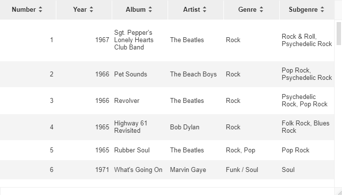
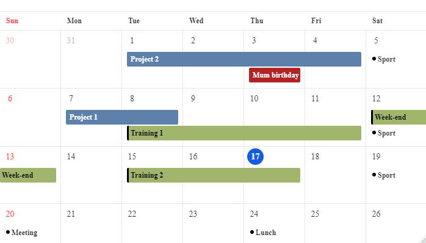
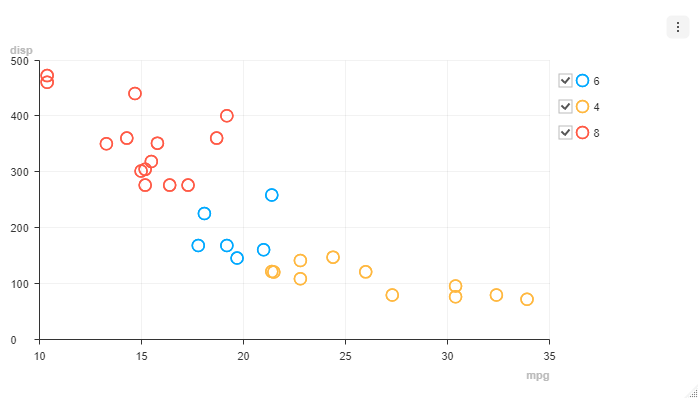

```{r, include = FALSE}
knitr::opts_chunk$set(
  collapse = TRUE,
  comment = "#>",
  eval = FALSE
)
```

```{r setup}
library(toastui)
```

[htmlwidgets](https://www.htmlwidgets.org/) to create:

* `datagrid()`: Interactive tables with data editing, filtering, sorting, and more
* `calendar()`: Interactive daily, weekly or monthly calendar
* `chart()`: Interactive charts


## Grid

Create interactive tables with lot of options to customize content and that you can edit in Shiny applications.

```{r grid}
datagrid(rolling_stones_50)
```



&#8680; [See full documentation and interactive examples](https://dreamrs.github.io/toastui/articles/extras/grid.html)


## Calendar

Create interactive calendars that you can navigate and display schedules. In Shiny you can add, update or delete schedules.

```{r calendar}
calendar(cal_demo_data())
```



&#8680; [See full documentation and interactive examples](https://dreamrs.github.io/toastui/articles/extras/calendar.html)


## Chart

Create interactive charts:

```{r chart}
chart(mtcars, caes(mpg, disp, color = cyl), type = "scatter")
```



&#8680; [See full documentation and interactive examples](https://dreamrs.github.io/toastui/articles/extras/chart.html)

